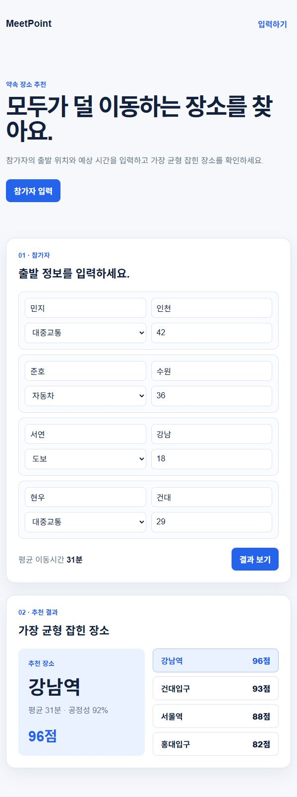
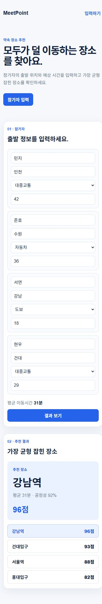

# 베이스 셋업 확인 결과와 스냅샷

확인일: **2026-10-07 / Asia/Seoul**

확인 대상은 기존 `master`를 출발점으로 한 **`chore/pbl-setup` 변경본**이다. 이 검증 결과를 기존 master에서 수행한 결과로 표시하지 않는다. 변경본 통합 후 팀원은 master를 다시 받아 실행한다.

## 저장소와 개인 브랜치 상태

| 브랜치 | 담당 / 역할 | 점검 당시 원격 커밋 |
| --- | --- | --- |
| master | 오윤식 / 통합 베이스 | `42dc4118fdf7e51b72b7b019701332fc6878fb37` |
| JJY | 조준영 / 개인 작업 | `be760acf431931160fc62816e3a8169d97298d58` |
| SHN | 서하늘 / 개인 작업 | `6a2d08f9bfe71c85a2cbafdb27550ca2234e2438` |

원본: https://github.com/jbaoro/PBL_MOBILE

이름/브랜치 연결은 사용자가 확인했다. 기존 SHN의 화면 변경은 별도 작업이며 이번 셋업에서 자동 병합하지 않았다. 셋업 변경의 실제 커밋은 PR의 Commits 화면에서 확인한다.

## 설치·실행 검증

- Windows PowerShell / Node.js 24.19.0
- Git clone으로 받은 저장소에서 `npm ci` 수행: lockfile 기준 501개 패키지 설치 성공
- `.env.example`의 기본 SQLite URL 사용; 별도의 비밀 키 없이 데모 검증

| 확인 | 결과 | 실제 근거 |
| --- | --- | --- |
| Prisma 스키마 | 통과 | schema is valid |
| Prisma Client | 통과 | 7.10.0 Client 생성 |
| 초기 DB 적용 | 통과 | init 마이그레이션 적용, User 테이블·고유 이메일 인덱스 생성 |
| 빈 DB 재현 | 통과 | 별도 scratch DB에 공유 SQL로 초기화 |
| 반복 DB 적용 | 통과 | 기존 확인용 행 보존, integrity_check=ok, 중복 이메일 제약 확인 |
| ESLint·타입 검사 | 통과 | 경고·오류 없음, tsc 종료 0 |
| 프로덕션 빌드 | 통과 | 페이지 및 signup API 빌드 완료 |
| 화면 HTTP | 통과 | GET / → 200 |
| 미완성 API 상태 | 통과 | POST signup → 501/준비 중 응답, GET → 405 |
| 입력 평균 갱신 | 통과 | 첫 시간 42→46 입력 시 평균 31→32분 |
| 후보 선택 | 통과 | 서울역 버튼 선택 시 장소/예시 점수 갱신 |
| 모바일 너비 | 통과 | 뷰포트 390px, 문서 너비 390px |
| 브라우저 콘솔 | 관찰 오류 없음 | 검증한 페이지의 warn/error 로그 없음 |

실제 명령 출력: [setup-checks.txt](evidence/setup-checks.txt)

## 셋업에서 고친 문제

기존 master의 `npm run build`는 빈 `app/api/auth/signup/route.ts`가 모듈이 아니라는 타입 오류로 실패했다. SHN에 있는 것과 동일한 준비 중 응답을 넣어 해결했다. 이 수정은 회원가입 완료를 의미하지 않는다.

Prisma 설정 파일명을 표준 `prisma.config.ts`로 통일했다. 이 환경에서 빈 SQLite 파일이 없으면 마이그레이션 명령이 Schema engine error로 실패했다. `prepare-sqlite.mjs`가 없는 파일만 배타적으로 생성하고 `db:setup`이 공유 마이그레이션과 Client를 준비하도록 구성하여, 기존 데이터 보존까지 검증했다.

## 실제 브라우저 화면

기본 화면 스냅샷은 실행된 베이스 데모이다. 화면의 참가자·후보·점수·공정성은 예시 데이터이고 실제 교통 API 결과가 아니다.

390px 모바일 뷰포트에서 입력과 결과가 가로 넘침 없이 표시된다.

## 미완료 및 최종 제출 단계

- 역할과 협업 방식은 팀 합의 전 제안안이다.
- 셋업 PR을 master로 통합하고 통합 커밋 기준으로 실행/README 화면을 다시 확인한다.
- 소유자가 교수 Collaborator 등록과 초대 수락 상태를 확인하고 화면을 추가한다. 연결된 계정에는 관리 권한이 없어서 이 항목은 확인하지 못했다.
- 실제 경로/장소 API, 약속 저장/확정, 인증, PWA 설치는 완료 검증 대상이 아니다.
- 설치 과정에서 기존 Next.js 14.2.15의 보안 업데이트 안내가 표시되었다. 기존 앱 의존성 버전은 이번 제출 셋업에서 변경하지 않았으며 배포 전 패치 버전 검토가 남는다.

학교 제출 시스템으로 업로드하거나 교수에게 연락하지 않았다. 제출 자료의 준비와 학교 제출 완료를 구분한다.
